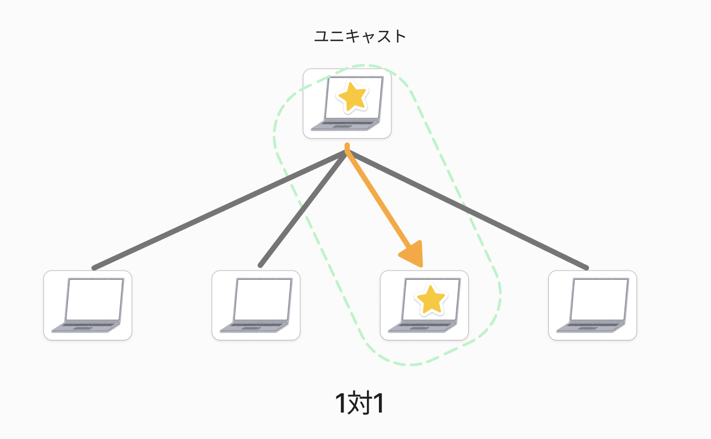
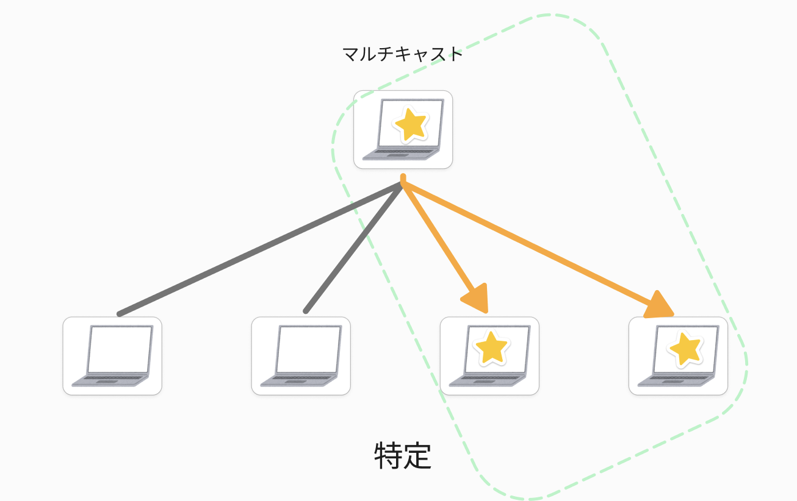

### 課題１

- イーサネットにおける`MACアドレス`の役割と仕組みについて、以下の点を踏まえて説明してください。
    - MACアドレスとは何か、その定義を簡潔に述べてください。

    コンピューターのNICやネットワーク機器の各ポートに対し製造時に重複無しに付与された番号。（16進数で12桁＝48ビット）

    個人メモ（世界中で重複しない固有の番号・フレームの送信元や宛先を識別するためにデータリンク層（で利用される））

    - MACアドレスがイーサネットの通信においてどのように使用されているのか、具体的に説明してください。
　　イーサネットフレームを送り届けるためのアドレス。
通信データのヘッダー部分に「送信先MACアドレス」と「送信元MACアドレス」を格納することで宛先や戻し先を確定しており、MACアドレスが無いと通信ができなくなります。
    

### 課題２

- ネットワーク通信における代表的な3つの通信方式である`ユニキャスト`/`ブロードキャスト`/`マルチキャスト`について、以下の点を説明してください。
    - それぞれの通信方式の定義と基本的な仕組みを、図や例を用いてわかりやすく解説してください。
    - 各通信方式の各通信方式の主な用途を挙げ、なぜその方式が適しているのかを考察してください。

ユニキャスト

単一のアドレスを指定して、1対1で行われるデータ通信のこと。
用途：Webサイトの閲覧、電子メールの送受信、ファイル転送
送信先を明確に指定できる、安定性と信頼性が高い。
 データは特定の受信者に限定して送信されるため、他のデバイスからの干渉を受けにくく安定した通信を確保できる為。

ブロードキャスト

特定のアドレスを指定して、1対複数で行われるデータ通信のこと。
用途：テレビ、ラジオ放送
一対多の通信を実現できるという大きな利点があり、送信者が一度に複数の受信者に情報を送信することができます。これにより、大勢の視聴者に対して情報をタイムリーかつ効果的に配信することが可能な為。

マルチキャスト

同じデータリンク内の全宛先を指定し、1対不特定多数で行われるデータ通信のこと。
用途：動画配信、オンラインゲームなど
ネットワークの帯域使用量を抑えられること。特定のアドレスへ同一の映像・音声データを同時に送信できるため、大容量データを複数の宛先へ送信する場合に有効な為。

### 課題３

- イーサネットフレームの各フィールドの役割を詳細に説明し、データの送受信においてどのように機能しているのかを述べてください。
    - プリアンブル：通信を行う際に新たなフレームの開始をノードに認識させるための信号。受信時に破棄される。
    - 宛先MACアドレス：宛先となるノードのMACアドレスを設定することで、どの宛先に送信するのかを定義します。（郵便物で例えると封筒に記載された住所（宛先）に近い）
    - 送信元MACアドレス：送信元のMACアドレスを設定します。（郵便物で例えると差出人の名前が記載されているイメージ）
    - タイプ：上位層のプロトコルが何であるか識別するためのもので１６進数で表される
    - ペイロード：（ヘッダなどの付加的情報を除いた）データ本体。
    - FCS：フレームのエラーを検出するためのフレーム。受信側と送信側でその（CRC値）が一致していることを確認します。

   メモ：CRC値 Cyclic Redundancy Check）送信したデータが正確に送られているかどうかを検証するためのデータ。