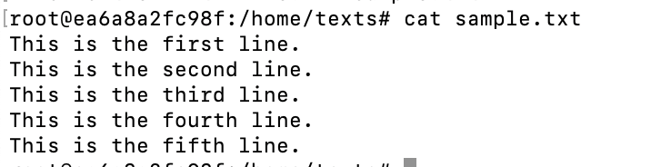

### 課題１

- Linuxカーネルとは何かを説明してください。カーネルがオペレーティングシステムにおいてどのような役割を果たしているかについて述べてください。

inuxカーネルとは：OSの本来の役割であるハードウェアの制御やファイル、ソフトウェアの実行、リソース等の管理を行う部分
役割：プロセス、メモリ、ファイルシステム、セキュリティの管理・権限管理などを行う

役割：　https://job-info.hateblo.jp/entry/2024/01/31/095336

- Linuxディストリビューションとは何か、およびその目的について説明してください。
    - いくつかの一般的なディストリビューションの名前を挙げ、それらがどのように異なるかの基本的な違いを説明してください。

   Linuxディストリビューションとは：①Linuxカーネルとその他ソフトウェア群を1つにまとめ、利用者が容易にインストール・利用できるようにしたもの②Linuxを利用しやすいようにアプリケーションなどをパッケージにしてすぐに使える状態にしたもの

   目的：

   引用：ウィキ・エンジニアの入り口

   1. Red Hat Enterprise Linux ( RHEL )　Red Hat社が開発　Red Hat系
・有名な商用向け、ビジネス用　・有料・責任を持ってサポートしてくれる　・商業向けの大規模なサービスを展開したい場合

   2.Ubuntu：Debianというディストリビューションから派生 Debian系
・初心者に優しく扱いやすい（WindowsやMacに近い）・個人的に使用する場合が多い・ソフトウェアセンターで様々なフリーソフトを簡単に導入できる

   3.CentOS：Red Hat系
・無償・商用サポートは充実していない
・RHELと同じ機能は欲しいが、無償化かつサポートなしで使用したい方向け

引用：課題研修youtube 20:30

- `CUI`と`GUI`の違いを説明してください。
    - 各インターフェースの利点と欠点を挙げ、特定のタスクにおいてどちらが適しているかを説明してください。

CUI：キーボードでコマンドを入力して操作　
利点：操作記録を残しやすい、複雑な操作や作業の自動化が容易
欠点：直感的な操作で作業ができない・操作に応じたコマンドを覚える必要がある。

GUI：マウスやタッチパネルを使用し操作
利点：直感的で分かりやすい、初心者でも扱いやすい
欠点：作業の手順を記録、共有しづらい・複雑な処理ができない

- シェルがLinuxシステムでどのような役割を果たしているかを説明してください。
システムにおいてユーザーとOSをつなぐインターフェースとしての役割を果たしています

### 課題２

- `ディレクトリ`とは何か、そして`ルートディレクトリ`と`カレントディレクトリ`の意味をそれぞれ説明してください。

ディレクトリ：階層構造を持ったファイルを保管する為の場所
ルートディレクトリ：階層構造の一番上にあるディレクトリシステムのこと
カレントディレクトリ：自分が今表示させているディレクトリのこと

引用：https://gmotech.jp/semlabo/webmarketing/blog/directory/

（個人メモ）【ディレクトリ】は主にLinuxというOSで使われる名称でWindowsやMacの場合は【フォルダ】と呼ばれる

- `パス`とは何か、そして`絶対パス`と`相対パス`の違いについて例を挙げて説明してください。
パス：ファイルやフォルダがおいてある場所、またはファイル名
絶対パス：一般的なWebサイトのURLやコンピュータ内のファイルの場所。完全に一意。
相対パス：今いる階層を基準としたときのファイルの場所。Webサイトの開発などで使われる。

    - チルダ(`~`)を使ったパスの例を挙げ、チルダ展開がどのように機能するかを説明してください。
cd ~
このcdコマンドでホームディレクトリに移動することが出来る
チルダ展開：cd ~　＝　cd /home/foo

（個人メモ）チルダは何を表す：ユーザのホームディレクトリの事を指す

- FHS（Filesystem Hierarchy Standard）の主要なディレクトリ「`bin`/`dev`/`etc`/`home`/`sbin`/`tmp`/`usr`/`var`」の役割について説明してください。

bin：ユーザーが利用するコマンドを置くディレクトリ
dev：デバイスファイルを置くディレクトリ　（メモ）デバイスファイル（ハードウェアを表すファイル）
etc：設定ファイルをおくディレクトリ
home：ユーザーのホームディレクトリ
sbin：システムに必要なコマンドを置くディレクトリ
tmp：一時的なファイルを保存
usr：複数のマシンに跨って共有可能なファイルを置くディレクトリ
var：サイズが変化するファイルを置くディレクトリ

引用：https://hogetech.info/linux/system/fhs

### 課題３

- `シンボリックリンク`について説明してください。

ファイルシステムの機能の一つで、特定のファイルやディレクトリを参照する別のファイルです。
シンボリックリンクを通じて参照されるターゲットファイル（またはディレクトリ）は、実際の場所や構造を変更することなくアクセス可能になります。このリンクは、参照先が移動された場合にはリンクが切れることがあり、元データとは独立しています。

- `シンボリックリンク`を使うと何が便利になるのか、具体例を1つ挙げて説明してください。

ファイルやフォルダを物理的な位置から独立して参照することができます。 
これにより、データを必要に応じて異なるドライブに移動できるため、ストレージ管理が容易になります

- `シンボリックリンク`と`ハードリンク`の違いを説明してください。

定義
シンボリックリンク

	•	定義：別の場所にあるファイルやディレクトリへのパス情報を保持する、ポインタのようなファイル。
	•	ファイルの関連性：リンク自体は独立したエンティティであり、リンク先のファイルまたはディレクトリへの参照情報のみを保持。リンク先が存在しない場合は無効になる。
	•	扱いやすさ：リンク先が移動または削除されると参照が無効になるため、リンク先の状態を管理する必要がある。
	•	ファイルシステム内／外での利用：異なるファイルシステムをまたがって利用可能。

ハードリンク
	•	定義：複数のファイル名が同じiノード（ファイルシステム上の識別子）を参照する形で作成されるリンク。
	•	ファイルの関連性：オリジナルとリンクが同じiノードを共有し、データそのものも共有している。
	•	扱いやすさ：データが共有されるため、どちらかで変更があればもう片方にも反映される。リンクの存在にかかわらずファイルを扱うことができる。
	•	ファイルシステム内／外での利用：同じファイルシステム内でのみ有効。

### 課題４

Linuxの基本コマンドについて学びましょう。以下の各コマンドがどのような目的で使われるのかを説明してください。

- pwd：現在自分がいる作業ディレクトリの表示
- cd：ディレクトリ間を移動する際に使用
- ls：ファイル・ディレクトリの一覧の表示
- mkdir：ディレクトリの作成
- touch：ファイルやディレクトリの更新日時を更新、ファイル等存在しなければ新規空ファイル作成
- rm：ファイルやディレクトリの削除
- rmdir：中身にデータが入っていないフォルダを削除
- cat：複数のファイルの中身を結合して、標準出力に出力
- less：ファイルの中身をページ送りしながら表示
- cp：ファイルやディレクトリのコピー
- mv：ファイルやディレクトリの移動、移動先が存在しなけれな名前の変更
- ln：ファイルやフォルダに対してリンクを作成
- find：ファイル・ディレクトリの検索
- locate：ファイル名やディレクトリ名を指定してファイルを検索（高速）
- man：コマンドの使い方に関するマニュアルを表示
- which：指定したコマンドのパスを表示

### 任意課題

- ls コマンドのオプション
よく使う
-l　ファイルの詳細情報を表示する
-a　隠しファイルも含めた全てのファイルを表示する
-F　ファイル種別を表示する
    - パス名展開

        - アスタリスクとクエスチョン
        ＊長さ0以上の文字列にマッチします。
        ？任意の一文字にマッチします。

    - ls 
    lsはディレクトリ内のファイル、フォルダの一覧表示
    - la
    lオプションは詳細表示　aオプションは全て表示
    合わせると全ての詳細表示表示

- 特定のディレクトリ内で拡張子が.htmlのファイルをまとめて削除する方法を調べ、実行してください。
test.html miina.html kai.htmlを使用

rm *.html
find ./ -type f -name "*.html" -delete

- catコマンドを使って行番号を表示する方法を教えてください。
- cat　-nをつけると表示できます

確認用

### 実践課題１

- ホームディレクトリに移動し、`project`ディレクトリを作成してください。
cd /home
mkdir project

- `project`ディレクトリの中に、`src/main/js`と`src/test/js`の2つのディレクトリを同時に作成する方法を調べ、実行してください。
mkdir -p src/main/js src/test/js

- `project/src/main/js`ディレクトリに移動し、カレントディレクトリを確認してください。
cd移動　ls確認

- `src/main/js`に`main.js`と`utils.js`という2つの空ファイルを作成する方法を調べ、実行してください。
touch main.js utils.js

- `utils.js`を`helper.js`という名前でコピーしてください。
cp utils.js ../main/helpre.js

- `project/src/test/js`に`test-main.js`/`test-utils.js`/`test-helper.js`の3つの空ファイルを一度に作成する方法を調べ、実行してください。
 touch test-main.js test-utils.js test-helper.js

    - 作成した`test-utils.js`を削除してください。
rm test-utils.js

    - 拡張子が.jsのファイルをまとめて削除する方法を調べ、実行してください。
find ./ -type f -name "*.js" -delete

- `project/src`ディレクトリに移動し、`test`ディレクトリを削除してください。
cd移動　 rm test

 - ホームディレクトリに移動し、ディレクトリを削除する別の方法を調べ、`project`ディレクトリをまとめて削除してください。
 rm -r project

### 課題２
- ホームディレクトリで`texts`ディレクトリを作成し、その中に移動してください。
mkdir texts

- `sample.txt`を作成し、以下の内容を書き込む方法を調べ、実行してください。

    This is the first line.
    This is the second line.
    This is the third line.
    This is the fourth line.
    This is the fifth line.

入力：echo "This is the・・・"  sample.txt
内容表示：cat sample.txt 

### 課題３

- `texts`ディレクトリの中に、`documents`ディレクトリを作成してください。
textsにcd：　 mkdir documents  

- `sample.txt`を`documents`ディレクトリに移動させてください。
mv sample.txt documents

- `documents`ディレクトリの名前を`docs`に変更してください。
mv documents docs

- `docs`ディレクトリをホームディレクトリに移動させてください。
mv docs /home
/をつけなかったら名前変更になった

- ホームディレクトリにある`docs`ディレクトリを、`texts`ディレクトリの中に移動させてください。
mv docs texts

### 課題４

- `texts`ディレクトリの中に、`symlinks`ディレクトリを作成し、その中に移動してください。
mkdir symlinks 

- `../docs/sample.txt`を指すシンボリックリンク`sample_link`を作成してください。
ln -s /home/texts/docs/sample.txt sample_link    

- `sample_link`の内容を表示し、`sample.txt`の内容と同じであることを確認してください。
cat sample_link

- `sample_link`を削除してください。
rm sample_link

###

課題５
拡張子が.htmlのファイルを検索し、そのファイル名を表示する。
find /home/myapp -name "*.html"  -type f

- ファイル名に`test`を含むファイルを検索し、そのファイル名を表示する。
find /home/myapp -name "*test*" -type f

ディレクトリ名にmainを含むディレクトリを検索し、そのディレクトリ名を表示する。
 find /home/myapp -name "*main*" -type d

ファイル名がindex.htmlまたはstyle.cssのファイルを検索し、そのファイル名を表示する。
find /home/myapp -name "index.html" -or -name "style.css" -type f

ファイル名にscriptを含み、かつ拡張子が.jsのファイルを検索し、そのファイル名を表示する。
find /home/myapp -name "*script*" -name "*.js" -type f

ファイル名にindexを含み、かつ拡張子が.htmlまたは.cssのファイルを検索し、そのファイル名を表示する。(indexでcssのファイルがなかったため確認できていないが、合っていると思う)
find /home/myapp -name "*index*.html" -or -name "*index*.css" -type f

※追記/home/myappの指定なくても大丈そう！

find ./ -type f -name "*.txt" -name "*miina*" -delete