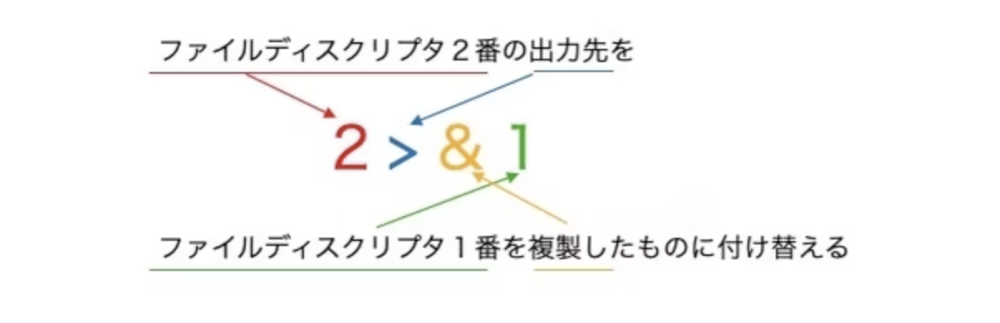

- エイリアスとは何かについて説明してください。
長いコマンド名を短い名前に置き換えたり，常に指定するオプションをあらかじめ設定したりできます。

    - エイリアスを作成するためのコマンドを例を挙げて説明してください。
ls -al を ll　に変更したい場合

alias ll='ls -al'

既存のエイリアスを確認し、削除する方法について説明してください。
既存エイリアスを確認：alias
削除：unalias 登録名

シェル変数とは何か、その役割について説明してください。

現在使用しているシェルの内部だけで有効な変数。

    - シェル変数の定義と参照方法を、具体的な例を用いて説明してください。
変数名=値

・環境変数とは何か、その役割と重要性について説明してください。
：別のシェルを起動したり、コマンドを実行した場合にも使用できる変数。

・環境変数を設定するための方法を説明してください。
：シェル変数を環境変数にするコマンド：export シェル変数

- 設定ファイルである`profile`/`bash_profile`/`bashrc`の違いについて説明してください。
profile：ログイン時にそのセッション全体に適用するものを記述する。シェルの種類に依存しないものを記述する
bash_profile：profileと同じに使えるが、bashのみで有効
bashrc：bashでしか使わないものを記述する

- 設定をどのファイルに書くべきか、状況に応じた適切な選択について説明してください。
profile：環境変数など
bash_profile：ログイン時に一度だけ実行する環境変数の設定
bashrc：エイリアス、シェルオプション、プロンプト設定

 `source`コマンドの使い方とその目的について説明してください。
ファイルに書かれたコマンドを現在のシェルで実行する

### 課題２

- `標準入力(stdin)`/`標準出力(stdout)`/`標準エラー出力(stderr)`の各用語を使用して、`標準入出力`について説明してください。

標準入出力とは、プログラムがデータを受け取り、結果を表示する仕組みのことです。キーボードなどからの入力が「標準入力」、プログラムが処理結果を表示する出力先が「標準出力」と呼ばれ、通常は画面に表示されます。また、エラーが発生した場合の出力先が「標準エラー出力」です。これらを合わせて「標準入出力」といいます。

- 標準入力のリダイレクト`<`を使用して、コマンドにファイルの内容を入力として渡す方法を調査し、実際に試してください。
cat < miina.txt 

grep "世界に" < miina.txt
返事：世界に一つだけの花
(miina.txtには世界に一つだけの花　歌詞の１番が入ってます)

- 標準出力のリダイレクト`>`を使用して、コマンドの出力をファイルに保存する方法を調査し、実際に試してください。
echo "That Arizona sky " > input.txt

- 標準エラー出力のリダイレクト`2>`を使用して、エラー出力をファイルに保存する方法を調査し、実際に試してください。

ls input.txt 2> kaikai.txt

(kaikai.txt により、ここにエラーメッセージは画面に表示されずにkaikai.txt というファイルに保存されます。)
- 標準出力と標準エラー出力の両方をまとめてリダイレクト`2>&1`を使用して、出力とエラーを一つのファイルに保存する方法を調査し、実際に試してください。

　ls existing_file.txt miina.txt > output_and_error.txt 2>&1

- `2>&1`の役割と意味について詳しく説明してください。
ファイルディスクリプタ２番（標準エラー出力）をファイルディスクリプタ１番（標準出力）と同じものにする際に使います
これを書いていないと、番号の省略は標準出力の意味になるため、 標準出力のみ log.txt に保存され、標準エラー出力は画面に出力されます。

- リダイレクトの`>`と`>>`の違いを説明してください。

>ファイルへの上書き
>>ファイルへの追記

- パイプライン(`|`)の働きと使い方について調査し、具体的な例を挙げて説明してください。

標準出力された内容を次のコマンドへ橋渡しする働き
最初のコマンドが結果を出し、その結果が次のコマンドに渡され、最終的な出力が得られるという仕組み

例：ls | grep "html"
現在のディレクトリのファイルやフォルダを一覧表示し、結果の中から「html」という文字を含むものを探ように、パイプラインはlsの結果を次のgrepコマンドに渡しています

- 標準入力を入力として受け取り標準出力に出力するコマンドフィルタの例を調査し、少なくとも3つのフィルタを紹介してください。

自信なし！
cat：ファイルの中身を全部表示する： cat -n /etc/hosts
tail：ファイルの中身の末尾を表示する ： tail -f -n 5 /etc/services
sort： 昇順/降順に表示する：sort -r file 
uniq： 重複する行を1行にして表示する ：uniq -c uniq
